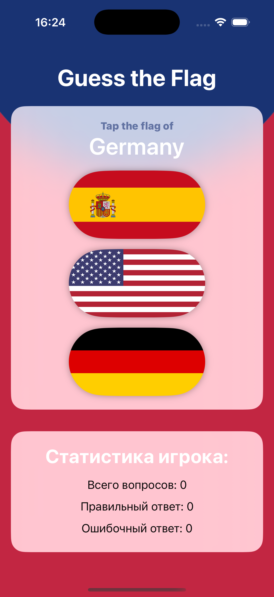
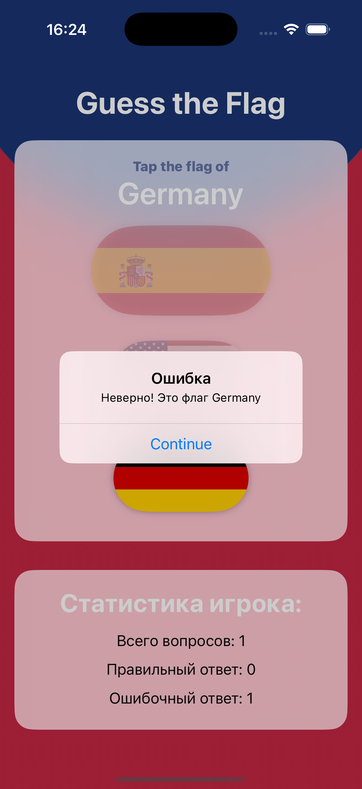
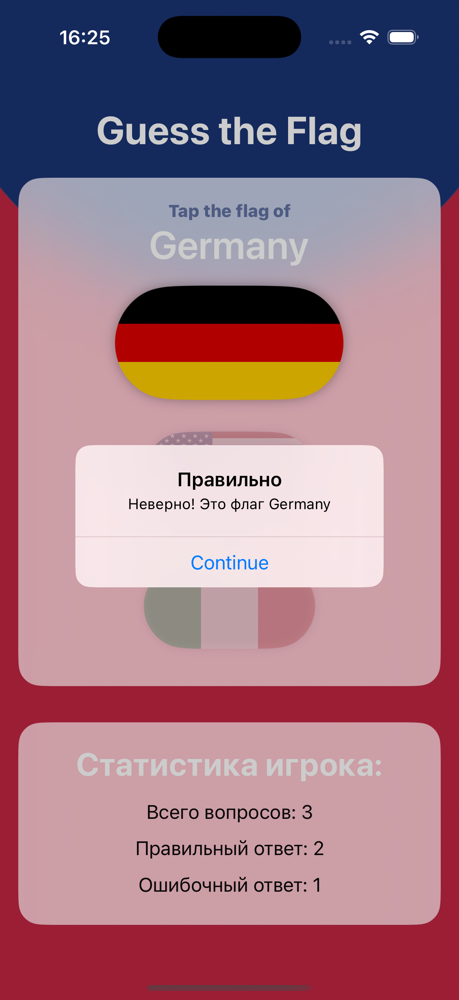
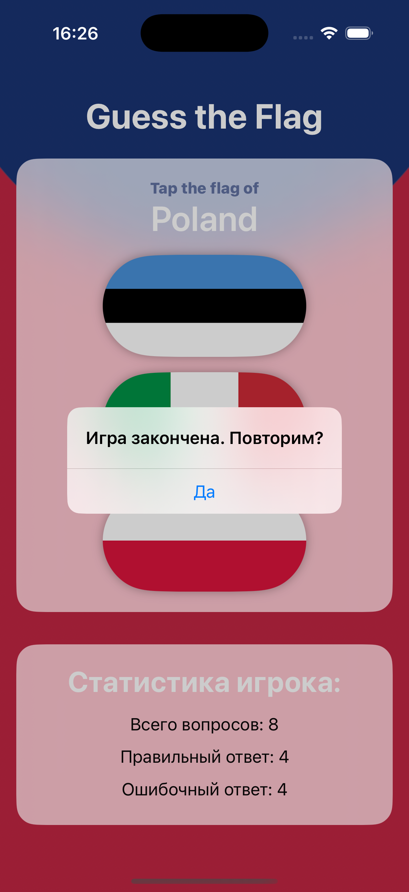

# GuessTheFlag

GuessTheFlag — это увлекательная игра, в которой пользователи могут проверить свои знания о флагах стран. Игра предлагает игрокам угадать, к какой стране принадлежит представленный флаг, что делает её отличным способом для изучения географии и флагов.

    

  

## Возможности

- **Интерактивный интерфейс**: Удобный и интуитивно понятный интерфейс для выбора ответов.

- **Разнообразие флагов**: Игра включает в себя множество флагов разных стран, что позволяет игрокам расширять свои знания.

- **Многоуровневая система**: Игроки могут проходить различные уровни сложности, начиная с простых и заканчивая более сложными.

- **Статистика**: Приложение отображает результаты игры и позволяет отслеживать прогресс.

## Установка

Чтобы начать работу с GuessTheFlag, выполните следующие шаги:

1. Клонируйте репозиторий:
   ```bash
   git clone https://github.com/Serge-17/GuessTheFlag.git
